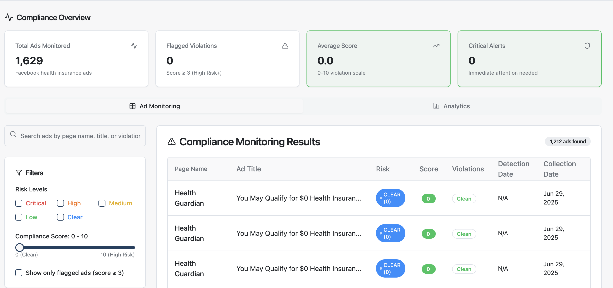
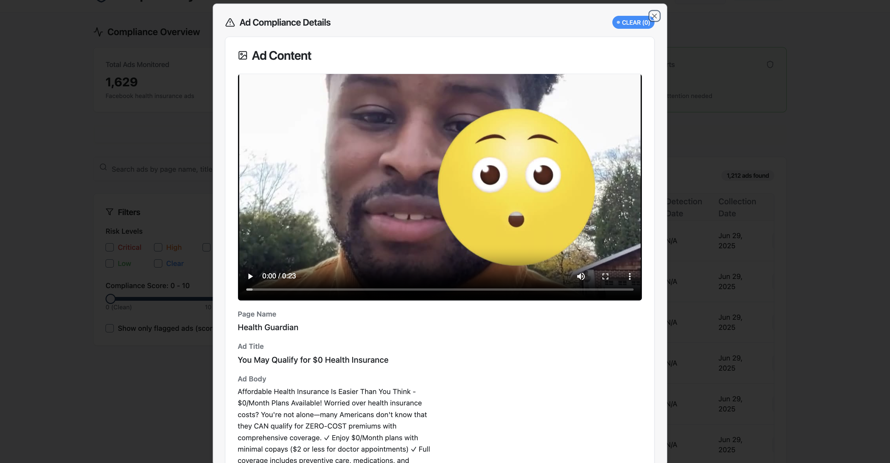
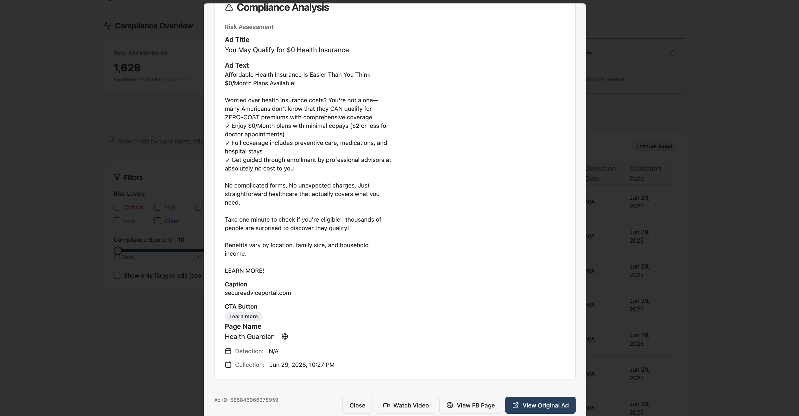

# Facebook Ads Compliance Dashboard

A comprehensive dashboard for monitoring and analyzing Facebook ads for compliance with insurance regulations. This tool helps identify potential violations, track risk levels, and ensure regulatory compliance across ad campaigns.

## Features

- **Real-time Metrics Dashboard** - View key compliance metrics at a glance
- **Ad Monitoring** - Detailed view of all ads with filtering and search capabilities
- **Risk Scoring** - Automated risk assessment for each ad
- **Violation Detection** - Identify potential compliance violations automatically
- **Direct Links** - Quick access to Facebook Ad Library for each ad

## Overview

This dashboard provides a user-friendly interface for compliance officers to monitor and review Facebook ads at scale. It connects to a pre-configured Supabase backend for data storage and retrieval.

## Getting Started

### Prerequisites

- Node.js (v16 or later)
- npm or yarn

### Installation

1. Clone the repository:
   ```bash
   git clone https://github.com/yourusername/compliance-eye-platform.git
   cd compliance-eye-platform
   ```

2. Install dependencies:
   ```bash
   npm install
   # or
   yarn install
   ```

3. Start the development server:
   ```bash
   npm run dev
   ```

4. Open [http://localhost:8080](http://localhost:8080) in your browser to view the application.

## Available Scripts

- `npm run dev` - Start the development server
- `npm run build` - Build the application for production
- `npm run preview` - Preview the production build locally
- `npm run lint` - Run ESLint to check code quality

## Project Structure

- `/src` - Source code
  - `/components` - Reusable React components
  - `/lib` - Utility functions and configurations
  - `/pages` - Page components
  - `/integrations` - Third-party service integrations (e.g., Supabase)

## Screenshots

### Main Dashboard

*The main dashboard interface showing compliance metrics and ad monitoring features.*

### Ad Detail View

*Detailed view of individual ad information with compliance status and violation details.*

### Risk Analysis

*Advanced risk analysis breakdown showing specific compliance issues detected.*

## License

This project is licensed under the MIT License - see the [LICENSE](LICENSE) file for details.
